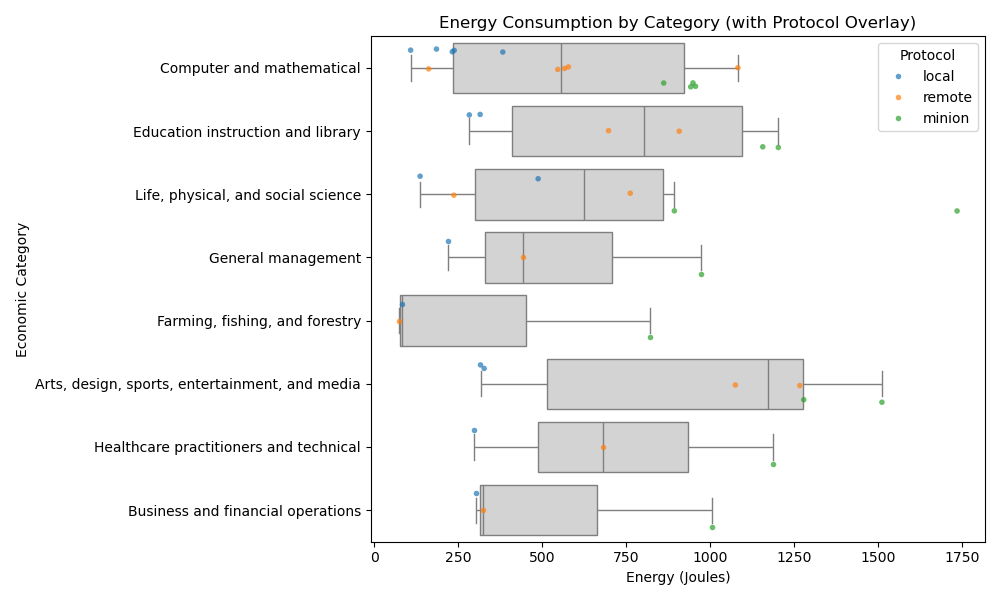
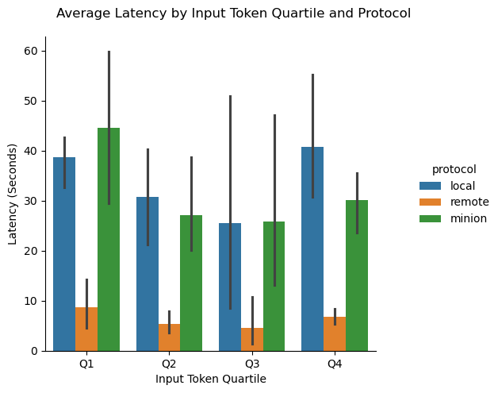
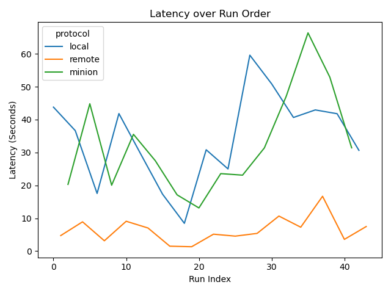
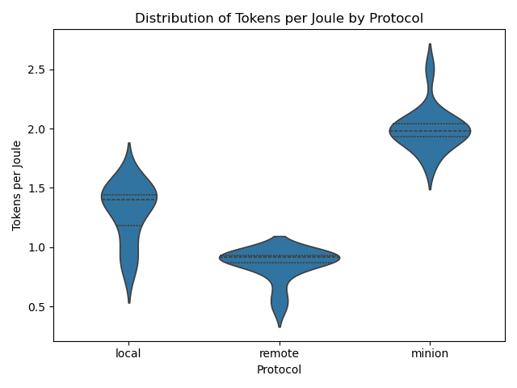
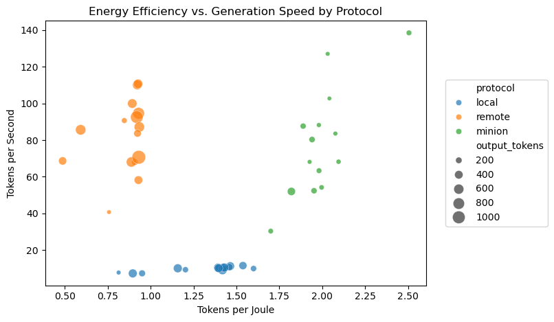
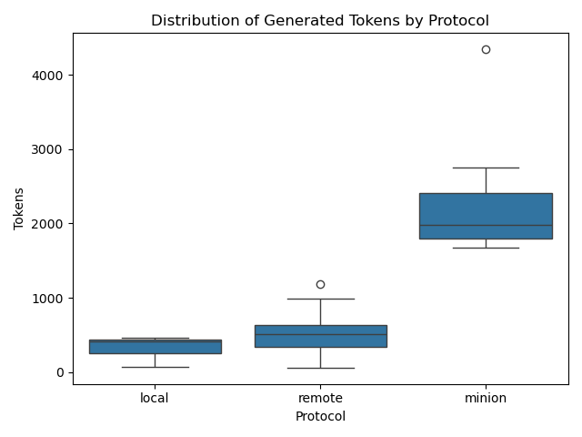
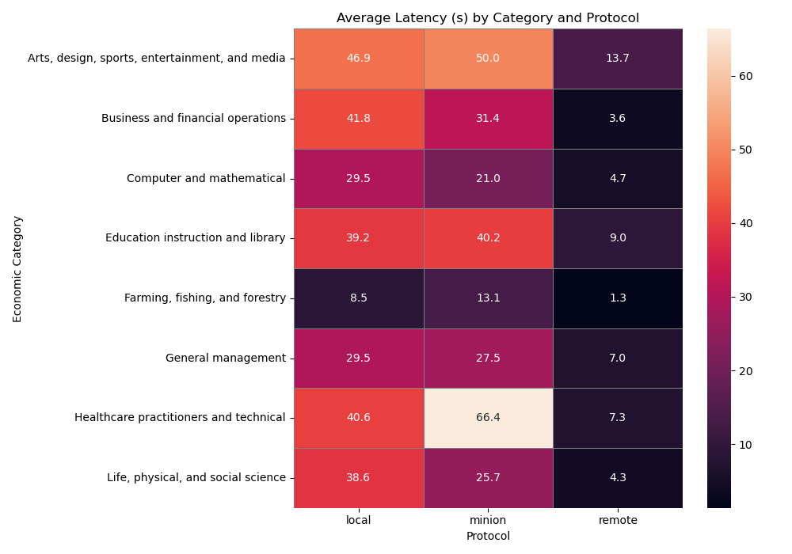

# MinionBench: A Benchmarking Framework for Edge-Cloud LLM Inference

MinionBench is an advanced benchmarking framework for evaluating different LLM inference protocols with a focus on performance, energy efficiency, and output quality. It supports thorough comparisons between local execution, cloud-based inference, and hybrid edge-cloud streaming approaches.

## Key Features
- **Stringent Preprocessing**: In preprocessing.ipynb, I implemented file ingestion, prompt extraction, supersetting, threshold-aware NSFW filters, economic‑category filters, missing‑field diagnostics, and a bevy of category/model plots to create a final DataFrame that could be used for the eval harness (clean, non‑empty, non‑NSFW, and domain‑correct).

- **Multi-protocol Support**: Benchmark across three distinct inference protocols:
  - **Local**: Inference runs entirely on a local, resource-constrained device via Ollama (Mistral model)
  - **Remote**: Calls to powerful cloud-hosted models (e.g., GPT-4o)
  - **Minion**: A hybrid edge/cloud streaming pipeline combining on-device caching with remote generation (GPT-4o + Mistral). I chose Minion as opposed to Minions, because Minions is optimized for long context parsing given a specific task, whereas my dataset was simply short Q&As.

- **Comprehensive Metrics**: Automated collection of:
  - Latency (total and streaming)
  - Energy consumption (device-level and on the cloud)
  - Token counts (input/output)

- **Diverse Workloads**: Pre-configured prompt sets spanning multiple domains:
  - Arts and entertainment
  - Business operations
  - Computer science
  - Education
  - Healthcare
  - Life sciences
  - General management
  - Agriculture and more

- **Rich Visualization Suite**: Generates a ton of insightful plots
  - Heatmaps
  - Boxplots
  - Scatterplots
  - Lineplots
  - Catplot
  - Violin Charts

## Getting Started

```bash
# Clone the repository
git clone https://github.com/your-username/minionbench.git
cd minionbench

# Install dependencies
pip install -r requirements.txt

# Run the benchmark
python main.py --sample 50  # Run on 50 random prompts

# Generate visualizations
python visualizations.py
```

---

# Performance Analysis & Results

## Methodology

This section presents a systematic analysis of three LLM inference protocols—local, remote, and Minion—evaluated across multiple dimensions:

- **Latency**: Total response time from prompt submission to completion
- **Energy efficiency**: Measured in tokens generated per joule of energy consumed
- **Throughput**: Token generation speed (tokens per second)
- **Output verbosity**: Total tokens generated per prompt

Our analysis uses a dataset of prompts spanning 8 economic categories, with each prompt processed through all three protocols under identical conditions.

## Results & Analysis

### 1. Raw Energy Consumption by Category



- **Minion** points frequently lie to the right of the gray boxes. For example, in "Farming, fishing, and forestry" a Minion data point appears near 900 J versus the box median of around 300 J.

- **Remote** inference often sits in the mid-range—around 600-800 J for "Arts, design, sports, entertainment, and media"—illustrating a stable but moderate energy cost.

- **Local** inference tops out under 500 J almost everywhere, demonstrating it's the cheapest in absolute energy consumption but also produces far less verbose outputs.

### 2. Raw Latency by Input Size



- **Short prompts (Q1)**: Minion peaks at approximately 45 seconds, remote at around 9 seconds, and local at about 39 seconds. This indicates Minion's startup overhead is most pronounced on small inputs.

- **Long prompts (Q4)**: Minion (~30 s) versus local (~41 s) versus remote (~7 s), showing that Minion scales better with input length than local inference does.

- **Variability**: Error bars illustrate high variance, with Minion's whiskers stretching up to 60 seconds in the middle quartiles (Q2-Q3).

### 3. Latency Drift Over Runs



- **Minion's** green curve shows significant jumps, from approximately 13 seconds (run 23) up to 66 seconds (run 33), revealing sensitivity to device load or caching warm-up conditions.

- **Remote** inference (orange) remains relatively flat between 1-17 seconds throughout the runs, highlighting the stability advantages of a dedicated cloud endpoint.

- **Local** inference (blue) shows occasional performance spikes (e.g., run 27 at 59 seconds), likely due to model swapping or GPU contention on the device.

### 4. Efficiency Distribution (Tokens per Joule)



- **Minion's** violin plot sits highest in the distribution, with a median around 2.0 tokens per joule and upper peaks reaching approximately 2.6 tokens per joule.

- **Remote** inference centers around 0.85 tokens per joule, indicating lower energy efficiency despite its speed advantages.

- **Local** inference shows efficiency ranging from 0.9 to 1.6 tokens per joule, reflecting a smaller model's limited output capability per unit of energy.

### 5. Efficiency vs. Speed Trade-Off (MOST IMPORTANT PLOT!!)



- **Minion** data points cluster in the top-right quadrant of the plot, with representative values of 2.49 tokens per joule and 138 tokens per second, showing strong performance on both metrics.

- **Remote** inference sits left of 1.2 tokens per joule but often achieves throughput above 60 tokens per second.

- **Local** inference remains positioned in the bottom-left quadrant, below 1.6 tokens per joule and under 15 tokens per second.

**Efficiency vs. speed is the heart of the story—and Minion wins at both. By clustering in the top-right of the plot, Minion proves it’s not just faster or greener — it’s both, decisively beating local and remote inference.**

### 6. Verbosity by Protocol



- **Minion** outputs often exceed 2,000 tokens, with outliers reaching beyond 4,300 tokens, making it the most verbose protocol.

- **Remote** responses typically fall in the 300-800 token range.

- **Local** inference is the most conservative in output length, generally producing under 500 tokens per prompt.

### 7. Latency Heatmap by Category



The heatmap reveals domain-specific performance patterns:

- For **Healthcare practitioners and technical** prompts: Minion takes 66.4 seconds, remote just 7.3 seconds, and local 40.6 seconds.

- For **Computer and mathematical** prompts: Minion requires 21.0 seconds versus remote's 4.7 seconds and local's 29.5 seconds.

This visualization helps identify the sweet spots—specific domains where Minion's batching and caching strategies outperform or underperform relative to the alternatives.

## Discussion & Implications

Our analysis reveals several key insights about the three inference protocols:

1. **Efficiency vs. Speed Tradeoffs**: Minion isn't the fastest or the most energy-efficient in absolute terms, but it delivers superior efficiency when measured in tokens per joule and competitive throughput once initialized.

2. **Input-Length Sensitivity**: Minion shows a clear pattern in performance based on prompt length. Its relative overhead is highest for small prompts, making it less suitable for brief interactions but increasingly advantageous for medium-to-large prompts.

3. **Domain-Specific Performance**: The protocols show significant variance across domains. Minion performs best in technical domains like computer science (21.0s vs. local's 29.5s) but struggles (takes more time) with healthcare-related prompts (66.4s vs. local's 40.6s).

4. **Output Verbosity Considerations**: Minion produces substantially more verbose outputs (up to 8x more tokens than local inference), which must be considered when interpreting raw efficiency metrics.

5. **Stability Characteristics**: Minion's performance varies more over time compared to the consistent remote inference, suggesting that deployment scenarios should account for potential variability.

## Future Work

Building on these results, several directions for future research emerge:

1. **Quality Assessment**: Overlay LLM-as-a-judge scores against efficiency metrics to determine if more generated tokens correlate with better final responses.

2. **Controlled Verbosity**: Experiment with capping max_tokens or implementing early-stopping mechanisms to control energy and latency budgets.

3. **Domain Optimization**: Further investigate why certain domains show better performance with different protocols to develop domain-specific inference strategies.
